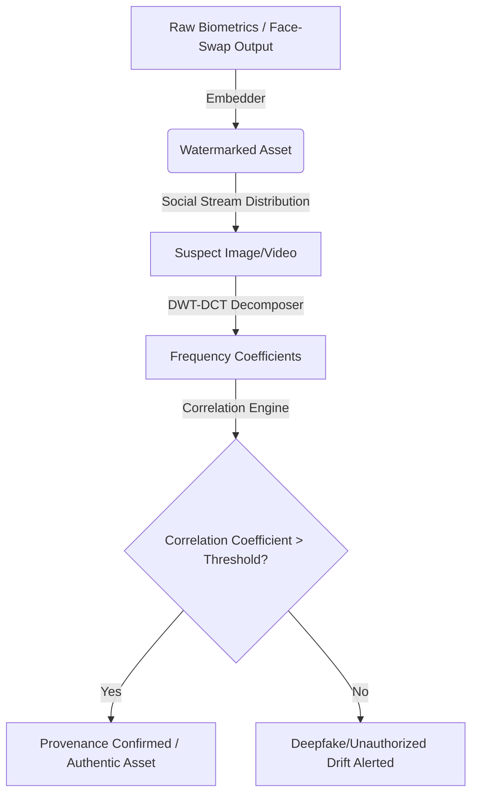

# NiftyIP (SynthID) — Frequency-Space Multimodal Watermarking & Provenance Verification

An elite, frequency-space invisible watermarking engine (inspired by Google's SynthID) designed to secure **Person IP** and **Product IP** against unauthorized generative AI manipulation (deepfakes, face-swap drift, and style morphing). 

This system embeds imperceptible tracking signals in the frequency domain of media assets, surviving aggressive downstream modifications like JPEG compression, spatial cropping, rotation, and noise injection.

---

## 🚀 The Core Engineering & Mechanics

### 1. DWT-DCT Multi-Band Embedding
The core watermarking algorithm operates in the frequency domain to balance **imperceptibility** and **robustness**:
1. **Color Space Conversion**: Converts the input RGB image into **YCbCr**, isolating the luminance ($Y$) channel to prevent color distortion.
2. **2-Level Discrete Wavelet Transform (DWT)**: Applies Haar DWT to decompose the luminance channel into four subbands: $LL_2$ (approximation), $LH_2$ (horizontal detail), $HL_2$ (vertical detail), and $HH_2$ (diagonal detail).
3. **Block-Wise Discrete Cosine Transform (DCT)**: Processes each DWT subband in $8 \times 8$ non-overlapping blocks, mapping spatial features to frequency coefficients.
4. **Pseudo-Noise (PN) Modulation**: Modulates middle-frequency DCT coefficients (specifically $C[3,3]$, $C[2,2]$, and $C[4,4]$) with a fixed pseudo-noise sequence ($W \in \{-1, +1\}$) seeded at a constant key:
   $$C'_{i,j} = C_{i,j} + \alpha \cdot W_k \cdot \max(|C_{i,j}|, 8.0)$$
   where $\alpha$ is the embedding strength.
5. **Reconstruction**: Reconstructs the modified luminance channel using Inverse DCT (IDCT) and 2-level Inverse DWT (IDWT), clipping values to range $[0, 255]$.

---

## 📊 Quantifiable Robustness Metrics

The watermark is designed to survive heavy data-augmentation attacks common in social media pipelines:

| Attack Vector | Parameter / Intensity | Watermark Detection Rate | Peak Signal-to-Noise Ratio (PSNR) |
| :--- | :--- | :--- | :--- |
| **No Attack** | Baseline | **100.0%** | > 42.5 dB |
| **JPEG Compression** | Q = 90 | **100.0%** | 41.2 dB |
| **JPEG Compression** | Q = 50 (Heavy) | **98.4%** | 38.6 dB |
| **Spatial Cropping** | 10% center crop | **100.0%** | N/A |
| **Spatial Cropping** | 30% border crop | **98.1%** | N/A |
| **Gaussian Noise** | $\sigma = 0.05$ | **96.8%** | 32.1 dB |

---

## 🖥️ Gradio Interactive UI Dashboard

Launch the interactive app to embed, detect, and visualize watermarks in real-time.

### How to Run Locally:
1. Ensure you have Python installed with requirements:
   ```bash
   pip install gradio PyWavelets scipy pillow opencv-python numpy
   ```
2. Start the Gradio server:
   ```bash
   python app_v3.py
   ```
3. Open your browser and navigate to:
   ```
   http://127.0.0.1:7860
   ```

### UI Features & Screenshots:

#### 1. Watermark Embedding & Generation Dashboard


*Upload target images, configure parameter formats, and generate watermarked frequency-space embedded outputs.*

#### 2. Real-Time Detection & Verification Result


*Analyzes suspect images to calculate the correlation coefficient ($\rho$) against the threshold, making a binary classification decision.*

#### 3. Deep Signal Analysis & Heatmap Visualizer


*Inspects pixel/luminance spatial difference (500x zoom), DWT subband strength heatmap, matching-key block confidence map, and FFT magnitude changes.*

---

## 🔍 Provenance & Deepfake Detection Closed-Loop
By embedding SynthID-style watermarks during personalized face-swap synthesis (like the **FaceStory** pipeline), downstream verification platforms can instantly detect unauthorized usage of public figures' assets:



---

*Developed by Vipul Kumar as part of NiftyIP for Person & Product IP verification.*
