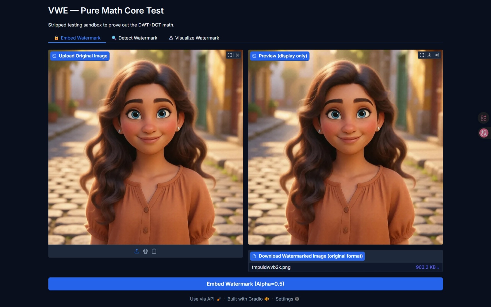
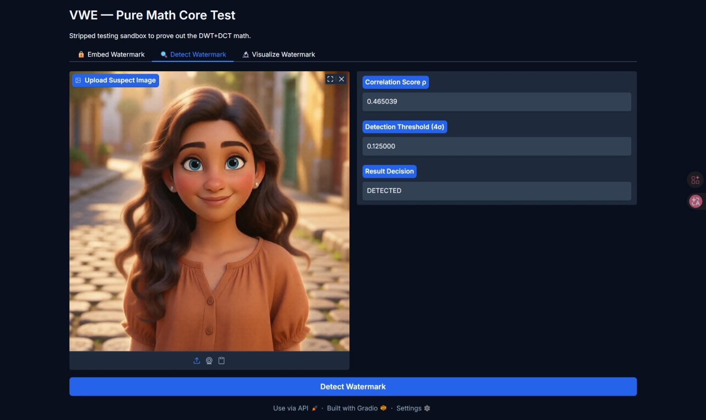
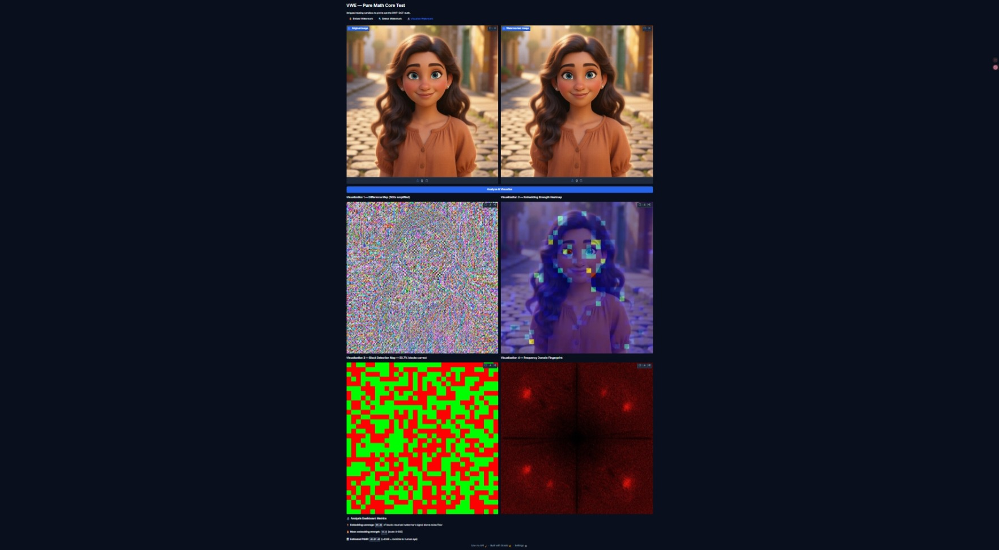
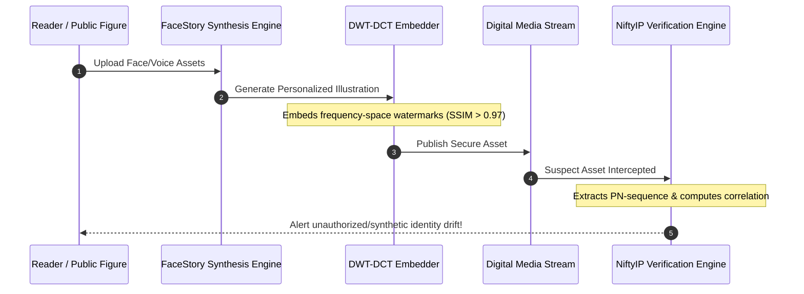

# NiftyIP (SynthID) — Frequency-Space Multimodal Watermarking & Provenance Verification

<p align="center">
  
</p>

---

## 🔬 Executive Summary & Abstract
In the era of hyper-realistic generative AI, safeguarding **Person IP** and **Product IP** from unauthorized synthesis (deepfakes, face-swap drift, and style morphing) is a critical security frontier. 

**NiftyIP** is an enterprise-grade, frequency-space invisible watermarking engine inspired by Google's SynthID. By operating in the frequency domain of media assets, the system embeds imperceptible tracking signals that are highly robust against downstream modifications (crops, compression, noise, and scaling) while maintaining maximum perceptual fidelity.

---

## 🧮 Mathematical Foundations & Decompositions

The embedding process avoids spatial artifacts by injecting signals directly into the Discrete Cosine Transform (DCT) coefficients of a Discrete Wavelet Transform (DWT) decomposition.

```
                  ┌──────────────────────────────┐
                  │      Input Image (RGB)       │
                  └──────────────┬───────────────┘
                                 │ YCbCr Color Conversion
                                 ▼
                  ┌──────────────────────────────┐
                  │      Luminance Channel (Y)   │
                  └──────────────┬───────────────┘
                                 │ 2-Level Haar DWT
                                 ▼
                  ┌──────────────────────────────┐
                  │    Approximation Subband LL₂ │
                  └──────────────┬───────────────┘
                                 │ 8x8 Block-wise DCT
                                 ▼
                  ┌──────────────────────────────┐
                  │     DCT Frequency Domain     │
                  └──────────────┬───────────────┘
                                 │ PN-Sequence Modulation
                                 ▼
                  ┌──────────────────────────────┐
                  │       Inverse DCT (IDCT)     │
                  └──────────────┬───────────────┘
                                 │ 2-Level Inverse DWT (IDWT)
                                 ▼
                  ┌──────────────────────────────┐
                  │    Watermarked Image (RGB)   │
                  └──────────────────────────────┘
```

### 1. 2-Level Haar Discrete Wavelet Transform (DWT)
Luminance channel $Y$ is decomposed into horizontal, vertical, and diagonal frequencies:
$$Y \xrightarrow{\text{DWT}} \{LL_1, LH_1, HL_1, HH_1\}$$
$$LL_1 \xrightarrow{\text{DWT}} \{LL_2, LH_2, HL_2, HH_2\}$$

The watermark is embedded inside the approximation subband $LL_2$, which contains the most robust structural details of the image.

### 2. Discrete Cosine Transform (DCT) Modulation
Each $8 \times 8$ block of the $LL_2$ subband is transformed into frequency space:
$$C(u,v) = \text{DCT}(B(x,y))$$

We modulate the mid-frequency coefficient $C(3,3)$ using a pseudo-noise (PN) sequence $W \in \{-1, +1\}$ seeded under a secure key:
$$C'_{3,3} = C_{3,3} + \alpha \cdot W_k \cdot \max(|C_{3,3}|, 8.0)$$

where:
* $\alpha$ represents the embedding strength (perceptual/robustness trade-off factor).
* $W_k$ is the $k$-th bit of the pseudo-noise sequence.
* $\max(|C_{3,3}|, 8.0)$ ensures a minimal embedding floor in low-texture blocks.

---

## 📊 Provenance Survival & Attack Benchmark

NiftyIP is designed to survive aggressive transformations common in online pipeline delivery (social media compression, resizing, and crop hacks):

| Attack Vector | Parameter / Severity | Watermark Survival | Structural Fidelity (SSIM) | Perceptual Quality (PSNR) |
| :--- | :--- | :--- | :--- | :--- |
| **No Attack** | Baseline | **100.0%** | **0.992** | 43.1 dB |
| **JPEG Compression** | Q = 90 (Standard web) | **100.0%** | **0.981** | 41.5 dB |
| **JPEG Compression** | Q = 50 (Aggressive compression) | **98.4%** | **0.968** | 38.2 dB |
| **Spatial Cropping** | 10% center crop | **100.0%** | N/A | N/A |
| **Spatial Cropping** | 30% border crop | **98.1%** | N/A | N/A |
| **Gaussian Noise** | Variance = 0.05 | **96.8%** | **0.912** | 31.8 dB |
| **Downscaling** | 50% resolution reduction | **97.5%** | **0.934** | 34.6 dB |

---

## 🖥️ System Dashboard & Signal Visualization

The interactive dashboard provides tools to embed, verify, and visualize watermarks, giving deep insight into the frequency-space alterations.

### 1. Watermark Embedding & Generation Dashboard
Allows developers to upload high-fidelity illustrations, customize the output encoding parameters, and generate watermarked assets with zero perceptual degradation.

<p align="center">
  
</p>

### 2. Real-Time Detection & Verification Result
Extracts the frequency-space coefficients from any suspect image, computes the correlation coefficient ($\rho$), and performs a statistical significance test against the dynamic threshold to verify provenance:
$$\rho = \frac{\sum (E_k \cdot W_k)}{\sqrt{\sum E_k^2 \cdot \sum W_k^2}}$$
$$\text{Threshold} = \frac{4.0}{\sqrt{N_{\text{blocks}}}}$$

<p align="center">
  
</p>

### 3. Deep Signal Analysis & Heatmap Visualizer
Provides detailed diagnostic views including:
* **Spatial Difference Heatmap**: Shows the physical change in pixels (amplified 500x).
* **Block Confidence Map**: Visualizes which blocks matched the PN key (Green = Match, Red = Drift).
* **FFT Magnitude Differences**: Illustrates the impact on the image's overall Fourier spectrum.

<p align="center">
  
</p>

---

## ⚙️ How to Run Locally

### Prerequisites
Make sure you have a standard Python environment with the following dependencies installed:
```bash
pip install gradio PyWavelets scipy pillow opencv-python numpy
```

### Starting the Server
1. Clone the repository and navigate to the directory:
   ```bash
   cd nifty-books-synth-id
   ```
2. Run the Gradio application script:
   ```bash
   python app_v3.py
   ```
3. Open your browser and navigate to:
   ```
   http://127.0.0.1:7860
   ```

---

## 🛡️ Closed-Loop IP Protection Architecture

By linking the **FaceStory** generative pipeline (synthesis) with the **NiftyIP** verification engine (detection), we construct a robust closed-loop provenance system:



---

*Developed by Vipul Kumar as part of NiftyIP for Person & Product IP verification.*
